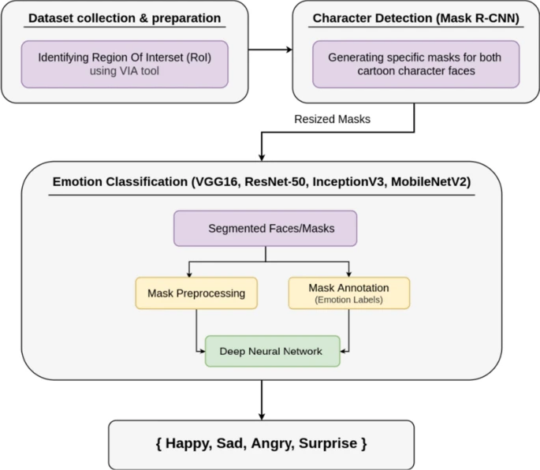
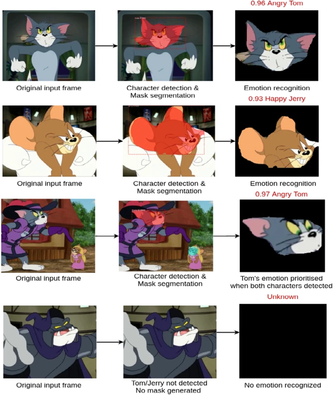

# *****CARTOON EMOTION RECOGNITION***** 

| [Research Paper](https://link.springer.com/article/10.1007/s00521-021-06003-9 "Research Paper") | 
[Dataset](https://github.com/Ankitchaudharyy/Cartoon_Emotion_Dataset/releases "Dataset") | [Mask-RCNN](https://github.com/Ankitchaudharyy/Mask-RCNN-Cartoon-Emotion-Recognition "Mask-RCNN") | 
[Notebook](./Tom_&_Jerry_TF_2_1_Combined.ipynb "Notebook") | [Models](./models "Models") |


### *OBJECTIVE*
This work deals with recognizing emotions from facial expressions of cartoon characters. The aim is to find out if DNNs can be deployed to extract and recognize emotions from cartoons. Even though emotion recognition has been extensively performed over human facial images; yet, recognizing emotions from cartoon images is still an under-explored area.

<br />

### *MOTIVATION*
The motivation behind this work lies in the fact that there are plenty of emotions portrayed in cartoons, even by the same character and animated cartoons provide an opportunity, where one can extract emotions from these characters (from one or more videos). 
This idea of identifying emotions is useful in cases where parents or guardians often want to choose a category of the cartoon (sci-fi, comic, humor, mystery, and horror) based on their child’s interest or according to their suitability.

<br />

### *CONTRIBUTION*
This work allow us to have multiple objectives: 
<br />
(A) The proposed integrated DNN includes **Mask R-CNN for cartoon character detection** and well-known **deep learning architectures/models**, namely VGG16, InceptionV3, ResNet-50, and MobileNetV2 **for emotion classification (Happy, Angry, Sad, Surprise)**.
<BR />
(B) As no state-of-the-art works provide large amount of data for validation, we created a **dataset of 8,113 images** and annotated them for emotion classification.

<br />
<br />


### *WORK FLOW OF THE PROPOSED APPROACH*
<p align="center">
  
</p>

<br />

### *Mask-RCNN Repository* - [Link](https://github.com/Ankitchaudharyy/Mask-RCNN-Cartoon-Emotion-Recognition "Link")

<br />

### *COMMANDS TO RUN*

```python
!python setup.py
```

```python
!python main.py ----maskrcnnweight [MaskRCNN_Weight] \
                --emotionweight [Emotion_Model_Weight] \
                --imagefolder [Test_Images_Directory] \
                --video [Test_Video_Directory] \
                --output [Output_Directory] \
                --savecsv [Predictions]
```
<br />

### *RESULTS*
Fine tuned VGG16 performs best with an **accuracy of 96%** and out-performs over other three models: InceptionV3, ResNet-50, and MobileNetV2.
<p align="center">
  
</p>

Detailed Results are described [here](https://link.springer.com/article/10.1007/s00521-021-06003-9#Sec13 "here"). 


